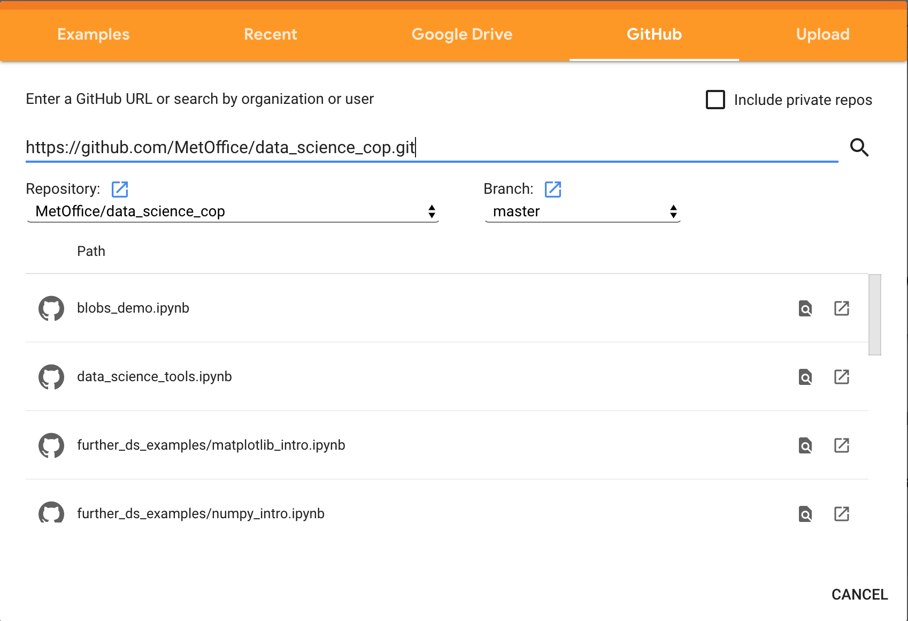

# Data Science Community of Practice
This is the repository for  example and tutorial matieral created through the Met Office Data Science Community of Practice.

## Running the code
There are several ways to set up an environment to run the code in this repository:

### Conda environment -> (click [here](https://docs.conda.io/en/latest/miniconda.html) for miniconda installation instructions)

* In a terminal, create an environment from the `requirements.yml` supplied with this repository  
``conda env create --file requirements.yml``

* Activate the environment  
``source activate data-science-cop``

* Run Jupyter Lab  
``jupyter lab``

* Navigate to the relevant notebook and run it.

### Met Office IT - Scitools 

* In a terminal, load the scitools environment  
``module load scitools``

* Run Jupyter Lab  
``jupyter lab``

* Navigate to the relevant notebook and run it.

### Pangeo
`` Under construction ``

### Google Colab

Instructions:

* Go to https://colab.research.google.com/. You may need to login with a Google account.

* Open a new notebook from GitHub, using the URL for the repository: 
``https://github.com/MetOffice/data_science_cop``  

* When you run the notebook, the required libraries will be installed when required.

